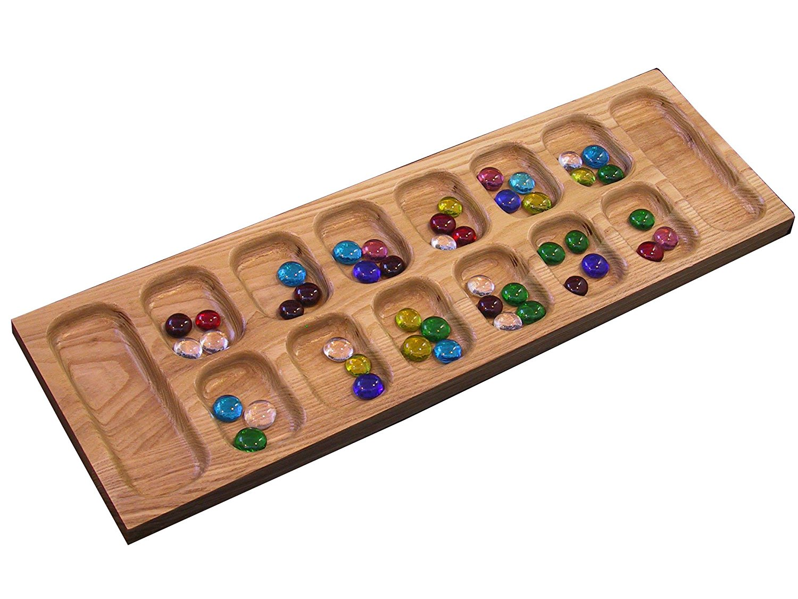

# Mancala

## Summary

Mancala is one of the oldest games in the world. You may know it as Congkak, Ali Guli Mane, Dakon, Oware, or many of the other names it goes by.

The idea is the same. It's a two-person game played with a simple board and some stones.

A Mancala board has two columns of `n` holes arranged in order--each with a corresponding hole on the "other side" (in other words, in the other column). At both ends, there's a larger "home" hole that belongs to the respective player.

`r` rocks are distributed evenly in the regular holes so that each hole has an equal amount of rocks. The home holes are left empty.

To play, a player chooses a hole of rocks to start with and picks up all the rocks in that hole. The column that the chosen hole belongs to is then considered the player's column. In a clockwise fashion, the player drops one rock in each subsequent hole and the player's own ohome hole (but not the home hole of the opponent), going around the board.

If the player's last rock ends in a hole that already has rocks, the player must pick up all the rocks in that hole and continue their turn.

If the player's last rock ends in a hole without any rocks, the player's turn ends.

If the player's last rock ends in their own home hole, the player gets to choose another hole of rocks at random, but in the player's own column.

Question: Given `r` rocks and a board with `n` holes (don't forget the home holes!), what's the most efficient first move you can make?